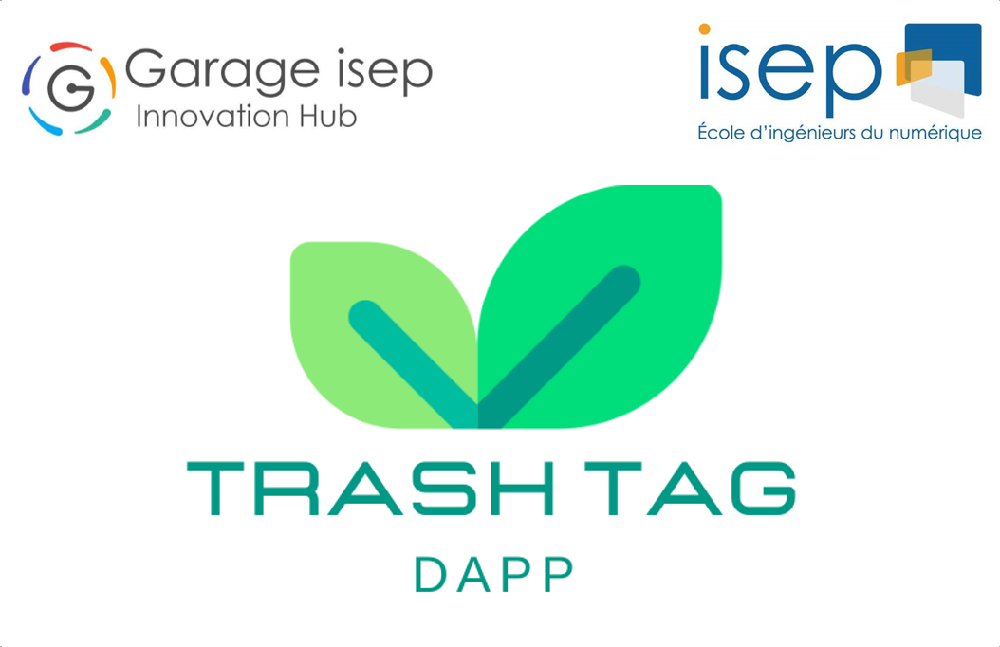
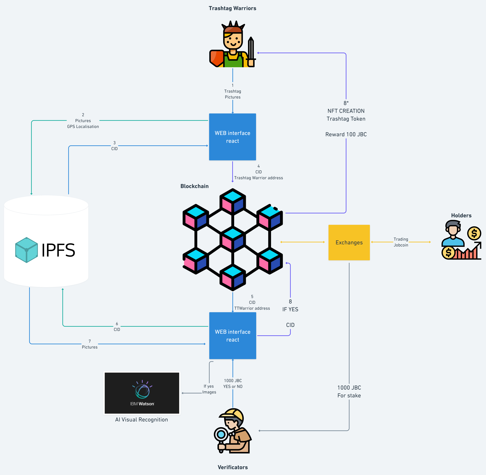
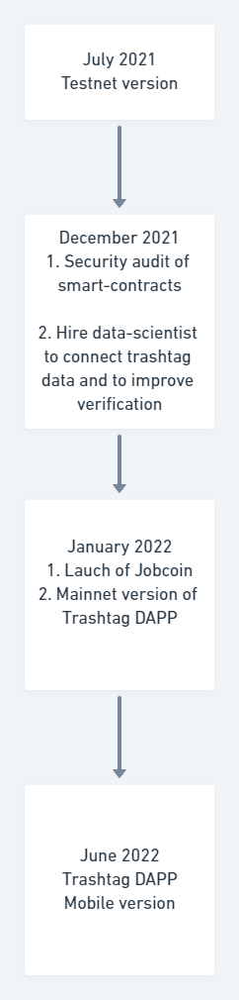
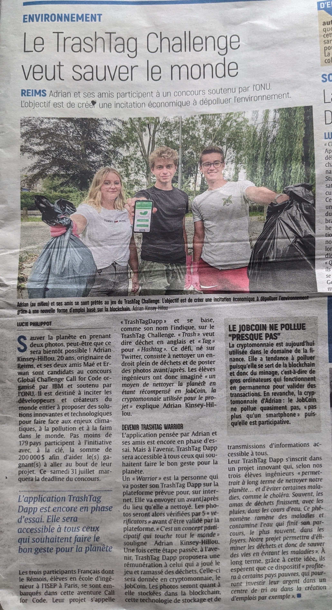

# TrashTag DAPP

Blockchain job to clean up environment and protect water supplies

## Contents

- [Submission or project name](#submission-or-project-name)
    - [Contents](#contents)
    - [Short description](#short-description)
        - [What's the problem?](#whats-the-problem)
        - [How can technology help?](#how-can-technology-help)
        - [The idea](#the-idea)
    - [Demo video](#demo-video)
    - [The architecture](#the-architecture)
    - [Long description](#long-description)
    - [Project roadmap](#project-roadmap)
    - [Getting started](#getting-started)
    - [Live demo](#live-demo)
    - [Built with](#built-with)
    - [Authors](#authors)
    - [License](#license)
    - [Acknowledgments](#acknowledgments)

## Short description

### What's the problem?

Wild pollution is a common problem in developed and in-developpement countries. This kind of pollution lead to a destruction of natural ecosystem and can be a source of potential disease. Plastic pollution in water supplies is responsible for the onset of disease such as cholera, diarrhea and dysentery. The problem is that it is very hard to fight against this kind of pollution because it’s very expensive to paid people to clean up natural areas.

### How can technology help?

Today, the most known cryptocurrency is Bitcoin, where the inflation system work with an electrical heavy consumption proof of work algorithm. That's mean to create a new bitcoin you need to resolve very complex mathematical problems. We believe that the blockchain environment is more mature thanks to smart contracts. So we created the Jobcoin. A cryptocurrency where a new supply is created each time a Trash tag challenge is done and verify. To remind, a Trash tag challenge is an ecological action where people find a place with wild pollution, take a picture, clean it up and take a picture again to show the work done. The ambition is to create an economic interests to protect natural environment thanks to a cryptocurrency.

### The idea

Our world is changing, we learn at school that a majority of job do not exist yet.
We believe that the blockchain revolution can lead to a new form of employment. An employment where crypto financial speculation can be directly connect to real value creation.
Trashtag challenges represent an ecological value creation for our environment.
In our Dapp, a trashtag challenge is represented by a non-fongible-token that we call a Trashtag Token. This token has to be approved by Verificators. They are independent users of our decentralized application which are judging of the veracity of the trashtag challenge. By a democratic vote, Verificators rewards the person which had done the trashtag challenge, we call them Trashtag Warrior. 
Blockchain job is a task job which is funded by a cryptocurrency, the Jobcoin, and ruled by blockchain.

Our idea is to create a job to collect wastes, with a decentralized application. It would:
1. Limit the amount of detritus which could end up in water supplies.  
2. Permit to local authority to saving money in collect of waste and to reinvest it to create recycling centers. 

You can look at "f. Blockchain job" section in our [long description](./docs/DESCRIPTION.md) to see how we could apply this technology to Zero Hungers and Green production problems.

## Demo video

## The architecture

1. The Trashtag warrior connect with his crypto wallet to the interface and upload trashtag pictures
2. Metadatas (pictures, localisation, datetime and phone orientation) are send to a decentralised storage network IPFS (standard for non-fongible token)
3. IPFS return an CID (url)
4. CID of Metadatas and trashtag warrior blockchain address are send in a waiting list on our smart-contracts 
5. Verificator interface receive the last trashtag challenge cid
6. Interface extract data from IPFS thanks to the CID
7. Trashtag Pictures are show to a verificator
8. If 5 Verificators valid the trashtag challenge, 100JBC and a trashtag token will be created for the trashtag warrior.
9. Each time a trashtag challenge is validate, pictures are send to the watson AI to train our model of trash tag visual recognition.

## Long description

[More detail is available here](./docs/DESCRIPTION.md)

## Project roadmap

See below for our proposed schedule on next steps after Call for Code 2021 submission.

## Getting started

To be able to use the Dapp, you need to have a crypto-wallet such as [Metamask](https://metamask.io/) on your web browser.
Then you need to select 'Rinkeby test network'.

1. git clone https://github.com/adrian-blockchain/Trash-Tag-decentralized-application

2. cd Trash-Tag-decentralized-application

3. npm install

4. npm start

Open http://localhost:3000 to view it in the browser.

The page will reload if you make edits.
You will also see any lint errors in the console.

## Live demo

To be able to use the Dapp, you need to have a crypto-wallet such as [Metamask](https://metamask.io/) on your web browser.
Then you need to select 'Rinkeby test network'.

We are sorry but we were not able to build correctly our react-ts application, webpack issues. So we could not ddeploy it on the ibmcloud foundery for the moment.
But you can test our dapp with the getting started section.

You can find a running system to test at [Trashtag-dapp.com](https://trashtagdapp.eu-gb.cf.appdomain.cloud/).

## Built with

- [IBM Cloud Foundry](https://www.ibm.com/cloud/cloud-foundry) - To host our the interface of our web application
- [IBM Watson AI for Visual recognition](https://developer.ibm.com/technologies/vision/) - Cloud annotation to develop a model of AI to detect trashtag challenge
- [Rinkeby Ethereum testnet](https://www.rinkeby.io) - Smart-contracts are immutable, so we wanted to test our dapp on a test network 

## Authors and Contributing

- Maë Bain (https://www.linkedin.com/in/ma%C3%AB-bain-164821192/)
- Adrian Kinsey-Hillou (https://www.linkedin.com/in/adrian-kinsey-hillou-241025203/)
- Erwann David (https://www.linkedin.com/in/erwann-david-949b49173/)

## Acknowledgments

- Thanks to all the Blockchain Lab of Garage ISEP, Nicolas Pasquier, Kevin Chhoa, Eyad Abdellatif, Enzo Cogneville and Raphaël Raux
- Thanks to Marion Fernandes, Clemence Verbergt and Maxime Antoine for their partcipation for the first decentralized trashtag challenge
- Thanks to Mamie Anne for the support
- Thanks to Lucie Philipot and the newspapper l'union for their article about our project:

